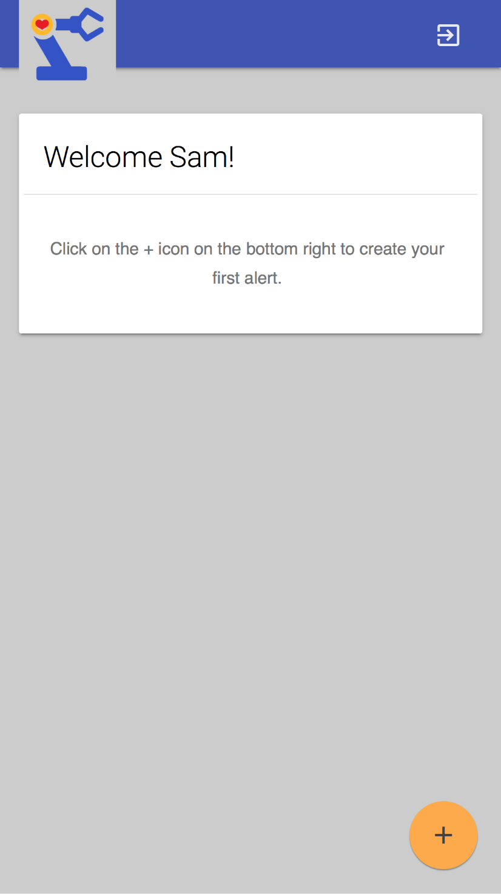
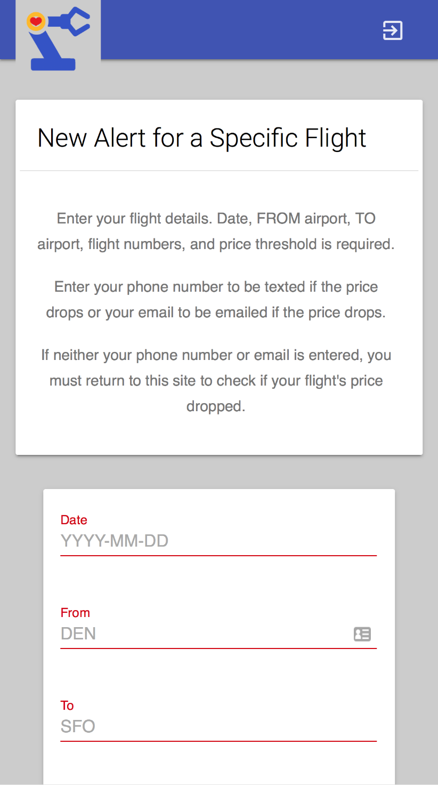
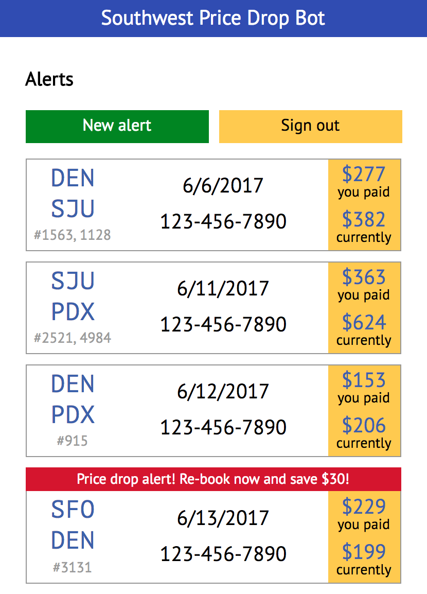
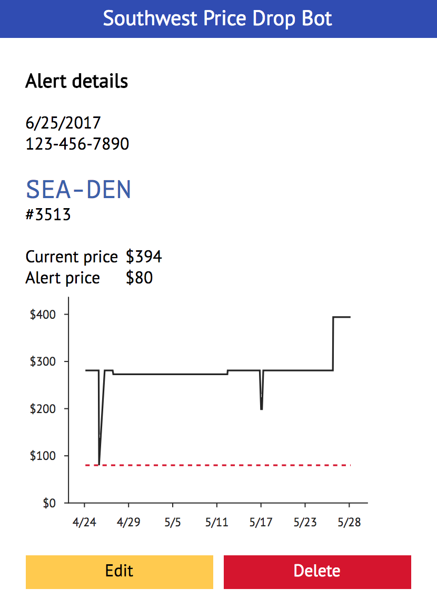
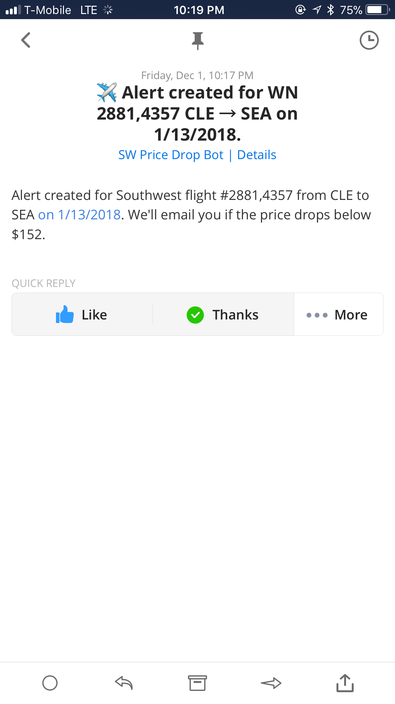

# ALERT!
### It seems SW got smart and is blocking the Heroku IPs from accessing their site. I'm trying to find a workaround, but it's tough. Local deployments should work fine, as should other cloud providers (Azure, AWS, Digital Ocean, etc).

### In the meantime, @GC-Guy added support for a proxy when making the calls to SW's site.

# Southwest Price Drop Bot

This tool lets you monitor the price of Southwest flights that you've booked. It will notify you if the price drops below what you originally paid. Then you can [re-book the same flight](http://dealswelike.boardingarea.com/2014/02/28/if-a-southwest-flight-goes-down-in-price/) and get Southwest credit for the price difference. This tool also lets you monitor the price of all Southwest flights on a given day. It will notify you if any flight on that day drops below the previous cheapest flight. 

Note that you need to have a [Plivo](https://www.plivo.com) account to send the text message notifications and a [Mailgun](https://www.mailgun.com) account to send the email notifications. You can run this tool without these accounts, but you won't get the notifications.

You can log in with either:

- The admin username/password combo, example: `admin` and `the-admin-password-123`
- A username/password combo, example: `mom` and `the-admin-password-123`

The second option is nice when giving out access to friends and family since it will only display alerts for the given username.  Note that the password is the same for all accounts, and the admin can see all alerts.

When creating alerts, note that the email and phone numbers are optional. If those are both left blank, the user will need to manually log in to view price drops.

## Deployment

1. Click this button: [![deploy][deploy-image]][deploy-href]
1. Fill out the config variables and click `Deploy`
1. Open up the `Heroku Scheduler` from your app's dashboard
1. Add an hourly task that runs `npm run task:check`

When updates become available, you will have to deploy them yourself using the [Heroku CLI](https://devcenter.heroku.com/articles/git).  This app follows [SemVer](http://semver.org/) in its versioning, so make sure to read the release notes when deploying a major version change.

Note: Deployed versions prior to 4/9/2018 using Mailgun will need to verify constants: `MAILGUN_DOMAIN` and `MAILGUN_EMAIL`.

Note: Deployed versions prior to 4/28/2018 (< 3.0.0) on Heroku will need to install the buildpack https://github.com/jontewks/puppeteer-heroku-buildpack

Note: Deployed versions prior to 7/21/2018 (< 3.2.0) on Heroku will need to verify the `PROXY` constant if you want to use a proxy to make the calls.

## Screenshots

<kbd>
  <a href="https://raw.githubusercontent.com/samyun/southwest-price-drop-bot/master/screenshots/welcome-no-alerts.png">
    
  </a>
</kbd>

<kbd>
  <a href="https://raw.githubusercontent.com/samyun/southwest-price-drop-bot/master/screenshots/new-alert.png">
    
  </a>
</kbd>

<kbd>
  <a href="https://raw.githubusercontent.com/samyun/southwest-price-drop-bot/master/screenshots/web-list.png">
    
  </a>
</kbd>

<kbd>
  <a href="https://raw.githubusercontent.com/samyun/southwest-price-drop-bot/master/screenshots/web-detail.png">
    
  </a>
</kbd>

<kbd>
  <a href="https://raw.githubusercontent.com/samyun/southwest-price-drop-bot/master/screenshots/email-alert.jpeg">
    
  </a>
</kbd>

<kbd>
  <a href="https://raw.githubusercontent.com/samyun/southwest-price-drop-bot/master/screenshots/sms.png">
    
  </a>
</kbd>

## Proxy information

Instructions on deploying a proxy is outside the scope of this project. However, here's some information about proxies that might be useful:

  * You could use something like [Squid](http://www.squid-cache.org) and spin in up natively, in a container, or in a VM. Obviously you'll want to do this outside of Heroku
  * If you do use Squid, you'll want to set up port forwarding or running on a high random port, and locking down `squid.conf` with something like this to prevent someone from using your setup as an open proxy:

  ```
  acl swa dstdomain .southwest.com
  http_access allow swa
  http_access deny all
  ```


## Version history
### [3.2.1] - 2018-7-23
  - Merge PR from @GC-Guy to fix proxy support in checks
### [3.2.0] - 2018-7-21
  - Merge PR from @GC-Guy to add support for a proxy
### [3.1.4] - 2018-7-14
  - Update package.json
  - Merge PR from @evliu to target the price list items more dynamically
### [3.1.3] - 2018-6-14
  - Flight data loaded after page is loaded - added wait for .flight-stops selector
  - Change URL to current format
  - Fix test to handle case of no prices found
  - Add tests for expected bad inputs 
### [3.1.2] - 2018-5-24
  - Add unit test for Alerts
  - Add additional logging and error handling
  - Attempt to reduce memory usage by manually calling about:blank prior to closing page
  - Add protocol to email link
### [3.1.1] - 2018-5-4
  - Fix bug with crash when email or phone number is not set but respective service is enabled
  - Add semaphore to limit number of pages open at once - hopefully fixing the "Error: Page crashed" error. Limited to 5 pages. Defaults to 5 pages at once - set ENV.MAX_PAGES to change.
### [3.1.0] - 2018-4-29
  - Add checks for invalid error
  - Add notification bars for invalid parameters
### [3.0.1] - 2018-4-28
  - Avoid multiple browser instances during task:check - reduce memory usage
  - Add nodejs buildpack for Heroku deployment
### [3.0.0] - 2018-4-28
  - Refactor to support updated Southwest site redesign, replace osmosis with puppeteer
### [2.1.0] - 2018-4-14
  - Add support for checking for the cheapest flight on a day
### [2.0.1] - 2018-4-9
  - Integrate upstream changes from PetroccoCo (email handling) and pmschartz (redesign)
### [2.0.0] - 2017-12-2
  - Support Mailgun and Plivo (email and sms) 
### [1.9.5] - 2017-11-30
  - Support Mailgun
### [< 1.9.5] 
  - Prior work

## Attribution

This is a fork of [minamhere's fork](https://github.com/minamhere/southwest-price-drop-bot) of [maverick915's fork](https://github.com/maverick915/southwest-price-drop-bot) of [scott113341's original project](https://github.com/scott113341/southwest-price-drop-bot).
Downstream changes were integrated from:
  * [PetroccoCo](https://github.com/PetroccoCo/southwest-price-drop-bot) - Email Handling
  * [pmschartz](https://github.com/pmschartz/southwest-price-drop-bot) - Redesign

Thanks to the following for their contributions:
  * @evliu - target the price list items more dynamically
  * @GC-Guy - proxy support


[deploy-image]: https://www.herokucdn.com/deploy/button.svg
[deploy-href]: https://heroku.com/deploy
